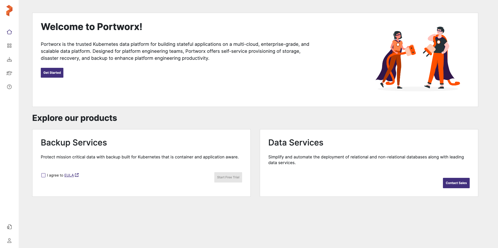

# Prerequisites

After creating a Kubernetes cluster we are ready to install portworx and the other cli tools.

---

### Portworx installation

Access the [Portworx Central Site](https://central.portworx.com/landing/login)

1. After logining in, press "Get started"
    

2. Select "Portworx Enterprise"
    

3. Design the Portworx cluster spec
    

4. After completed all the steps you should get two yaml urls, Apply them (takes up to 10 minutes).


After applying them a few things are being created:

- Portworx Operator: Which integrates with Kubernetes through CRD's to provide seamless provisioning, lifecycle management, monitoring, and security for persistent storage resources within containerized environments.

- Portworx StorageCluster: The StorageCluster object provides a Kubernetes native experience. You can manage your Portworx cluster just like any other application running on Kubernetes. That is, if you create or edit the StorageCluster object, the operator will create or edit the Portworx cluster in the background.


<sup><strong>Note:</strong> Wait for all the pods that are being created by the storagecluster to be ready.</sup>

### Cluster Inspection and administrative tools

Now after creating the Portworx cluster we would like to inspect it.

We can inspect its resources with:
```bash
kubectl get pod -n kube-system
```

For a more detailed look:
```bash
kubectl get storagecluster
```

Another way we can inspect our cluster and preform administrative tasks is using the following cli tools:
- pxctl: The pxctl command-line tool for Portworx allows users to perform detailed management of Portworx resources cluster-wide. It enables management of volumes, snapshots, cluster resources, hosts, and software upgrades.
- storkctl: storkctl is a command-line tool for managing Storage Orchestration for Kubernetes (Stork), enhancing Kubernetes' storage capabilities. It provides advanced data management and disaster recovery features, including:
    - Volume Snapshots: Create, list, and delete persistent volume snapshots.
    - Migration: Migrate applications and their data across clusters.
    - Backup and Restore: Back up applications and restore them when needed.
    - Scheduling Policies: Automate backups, snapshots, and migrations based on policies.
    - Resource Management: Monitor and manage storage resource usage.
    Basic commands include viewing cluster info, creating volume snapshots, starting migrations, and managing backups. storkctl simplifies operations, improves data management, and enhances reliability for Kubernetes administrators.

#### Install pxctl and storkctl

For pxctl:
```bash
cp ./snippets/pxctl /usr/local/bin/pxctl
chmod +x /usr/local/bin/pxctl
```

For storkctl:
```bash
STORK_POD=$(kubectl get pods -n kube-system -l name=stork -o jsonpath='{.items[0].metadata.name}')
kubectl cp -n  "$PORTWORX_NS" $STORK_POD:/storkctl/linux/storkctl ./storkctl
mv ./storkctl /usr/local/bin/storkctl
chmod +x /usr/local/bin/storkctl
```

#### Usage

Portworx cluster status:

```bash
pxctl status
```
